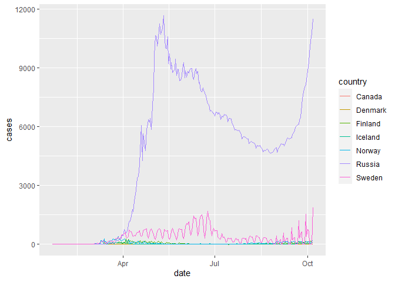

Untitled
================

# In-class exercises for Oct 7 2020

<br>

First load the libraries and data we will need

``` r
library(tidyverse)     ## install.packages("tidyverse")
```

    ## -- Attaching packages ------------- tidyverse 1.3.0 --

    ## v ggplot2 3.3.2     v purrr   0.3.4
    ## v tibble  3.0.3     v dplyr   1.0.2
    ## v tidyr   1.1.2     v stringr 1.4.0
    ## v readr   1.3.1     v forcats 0.5.0

    ## -- Conflicts ---------------- tidyverse_conflicts() --
    ## x dplyr::filter() masks stats::filter()
    ## x dplyr::lag()    masks stats::lag()

``` r
library(skimr)        ## install.packages("skimr")

coronavirus <- read_csv('https://raw.githubusercontent.com/RamiKrispin/coronavirus/master/csv/coronavirus.csv', col_types = cols(province = col_character()))
```

<br>

### Exercise 1

Subset the coronavirus dataset to only include the daily counts of
**confirmed** cases in countries located above 60 degree latitude. What
are those countries?

If you have time, pipe it into ggplot() to visualize the trends over
time in these
countries.

<br>

``` r
confirmed_coronavirus <- filter(coronavirus, type == "confirmed", lat >=60)
View(confirmed_coronavirus)

ggplot(data = confirmed_coronavirus, mapping = aes(x = date, y = cases, color = country)) +
  geom_line()
```

<!-- -->

### Exercise 2

Make sure you have run this code first:

``` r
coronavirus_ttd <- coronavirus %>% 
  select(country, type, cases) %>%
  group_by(country, type) %>%
  summarize(total_cases = sum(cases)) %>%
  pivot_wider(names_from = type,
              values_from = total_cases) %>%
  arrange(-confirmed)
```

    ## `summarise()` regrouping output by 'country' (override with `.groups` argument)

``` r
coronavirus_ttd %>%
  mutate(deathrate = death / confirmed) %>% 
  select(deathrate, everything())
```

    ## # A tibble: 188 x 5
    ## # Groups:   country [188]
    ##    deathrate country      confirmed  death recovered
    ##        <dbl> <chr>            <dbl>  <dbl>     <dbl>
    ##  1    0.0281 US             7500964 210886   2952390
    ##  2    0.0155 India          6757131 104555   5744693
    ##  3    0.0297 Brazil         4969141 147494   4430340
    ##  4    0.0175 Russia         1231277  21559    984767
    ##  5    0.0311 Colombia        869808  27017    770812
    ##  6    0.0396 Peru            829999  32834    712888
    ##  7    0.0394 Spain           825410  32486    150376
    ##  8    0.0265 Argentina       824468  21827    660272
    ##  9    0.104  Mexico          794608  82348    676923
    ## 10    0.0250 South Africa    683242  17103    616857
    ## # ... with 178 more rows

Then add a new variable that shows the proportion of confirmed cases for
which the outcome is still unknown (i.e. not counted as dead or
recovered) for each country and show only countries with more than 1
million confirmed cases. Which country has the lowest proportion of
undetermined outcomes? Why might that be?

``` r
coronavirus_ttd %>%
  mutate(undet = (confirmed - death -recovered)/confirmed) %>%
  filter(confirmed > 1000000) %>% 
  arrange(-undet)
```

    ## # A tibble: 4 x 5
    ## # Groups:   country [4]
    ##   country confirmed  death recovered  undet
    ##   <chr>       <dbl>  <dbl>     <dbl>  <dbl>
    ## 1 US        7500964 210886   2952390 0.578 
    ## 2 Russia    1231277  21559    984767 0.183 
    ## 3 India     6757131 104555   5744693 0.134 
    ## 4 Brazil    4969141 147494   4430340 0.0787

### Exercise 3

How many countries have suffered more than 100,000 deaths so far and
which five countries have recorded the highest death counts?

``` r
coronavirus_ttd %>%
  filter(death >100000) %>%
  arrange(-death)
```

    ## # A tibble: 3 x 4
    ## # Groups:   country [3]
    ##   country confirmed  death recovered
    ##   <chr>       <dbl>  <dbl>     <dbl>
    ## 1 US        7500964 210886   2952390
    ## 2 Brazil    4969141 147494   4430340
    ## 3 India     6757131 104555   5744693

``` r
coronavirus_ttd %>%
  arrange(-death)
```

    ## # A tibble: 188 x 4
    ## # Groups:   country [188]
    ##    country        confirmed  death recovered
    ##    <chr>              <dbl>  <dbl>     <dbl>
    ##  1 US               7500964 210886   2952390
    ##  2 Brazil           4969141 147494   4430340
    ##  3 India            6757131 104555   5744693
    ##  4 Mexico            794608  82348    676923
    ##  5 United Kingdom    532779  42535      2417
    ##  6 Italy             330263  36030    234099
    ##  7 Peru              829999  32834    712888
    ##  8 Spain             825410  32486    150376
    ##  9 France            675736  32383    101443
    ## 10 Iran              479825  27419    394800
    ## # ... with 178 more rows

### Exercise 4

1.  Go back to our original dataset coronavirus and identify where and
    when the highest death count in a single day was observed. Hint: you
    can either use or base::max or dplyr::arrange()

2.  The first case was confirmed in the US on January 20 2020, two days
    before the earliest day included in this dataset. When was the first
    confirmed case recorded in Canada?

<br>

### Exercise 5

Which day has had the highest total death count globally so far?

If you have time, pipe your global daily death counts into ggplot to
visualize the trend over time.

<br>

### Extra question

The month() function from the package lubridate extracts the month from
a date. How many countries already have more than 1000 deaths in
October?
